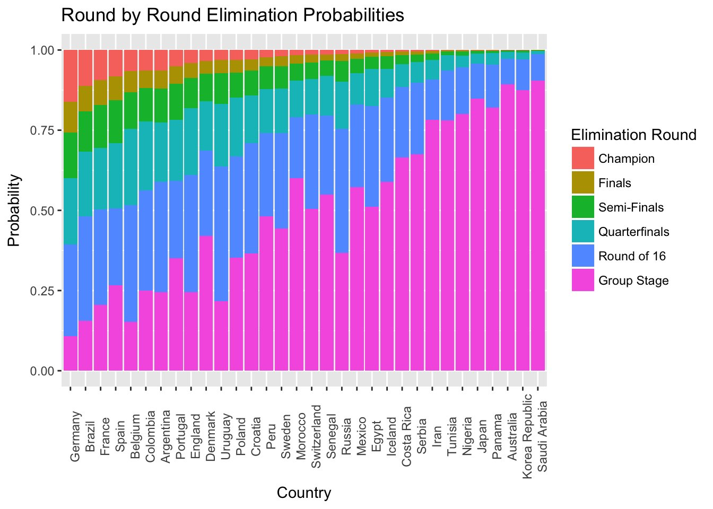
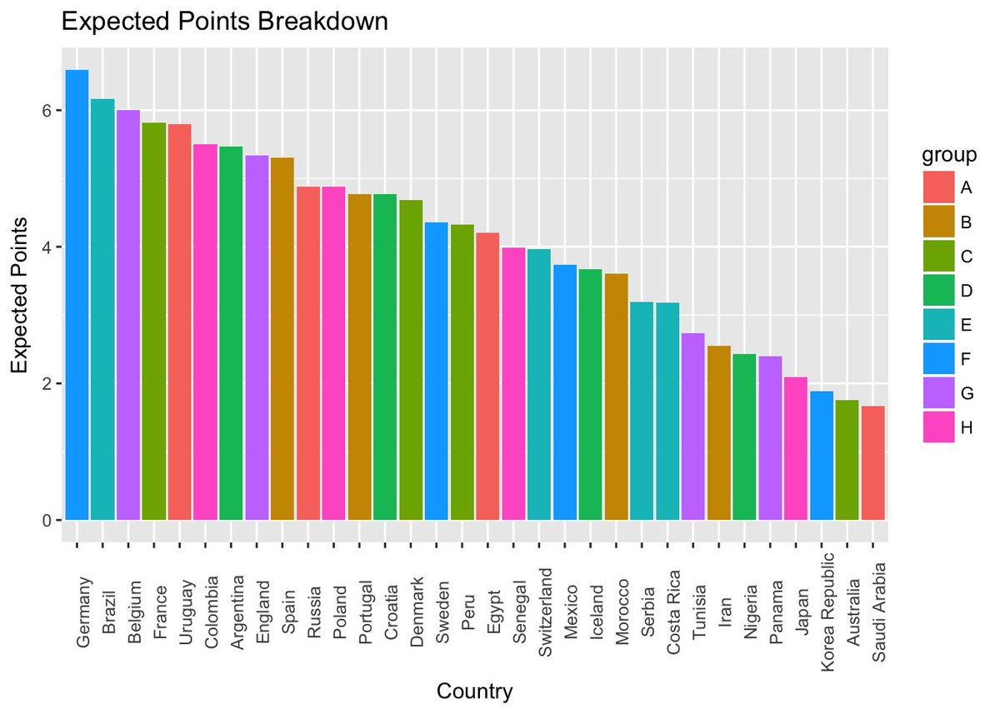
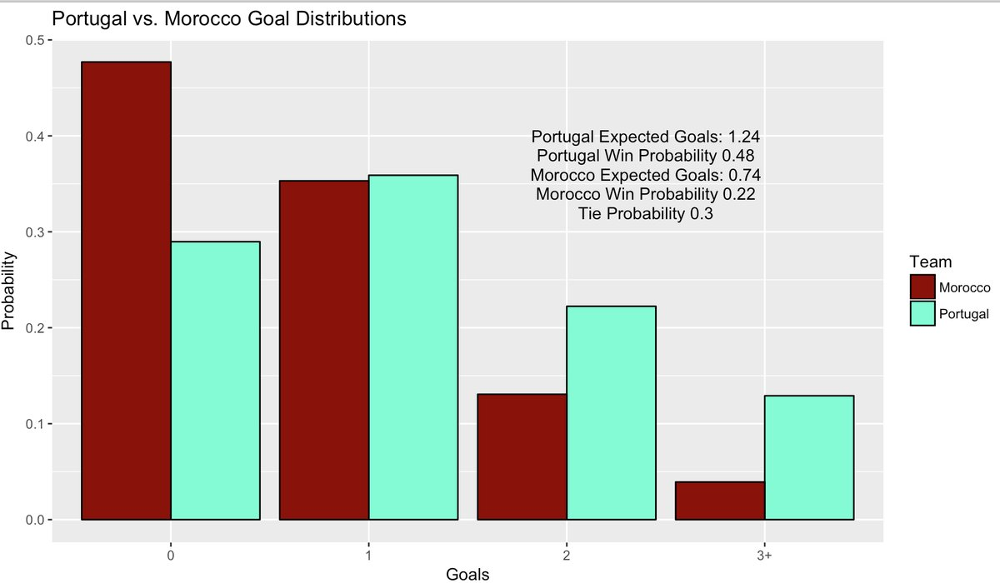
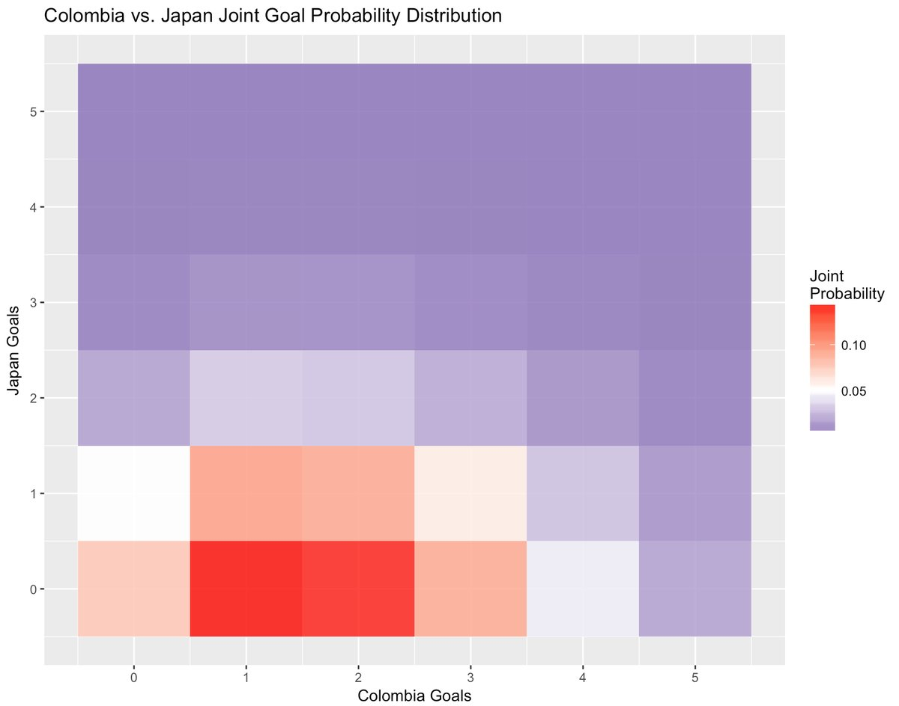

# world_cup
### Modeling and Simulation for the 2018 FIFA World Cup.
* __world_cup.R:__ File builidng Poission regression model to predict and simulate the 2018 FIFA World Cup
* __international_soccer_game_data.csv:__ Data for intertional soccer matches dating back to 1872.
* __fixtures.csv:__ Fixtures and results for matches played in the 2018 FIFA World Cup
* __rankings.csv:__ International soccer rankings producted from model coefficients.
* __wc_sims.csv:__ Up to date probabilities for each country to advance to each round of the World Cup.
* __knockoutdisparty.R:__ Script for scraping historical data from Wikipedia to examine Knockout Round talent disparity between 2 halves of bracket for every tournament since 1998.

Methodology can be found [here](http://rpubs.com/lbenz730/world_cup_model).

### Graphical Examples


Pre-World Cup Round by Round Elimination Probabilities



Pre-World Cup Expected Points in Group Stage



Example of goal distribution plot, Portugal vs. Morocco (06/20/2018)

```goal_plot(team1 = "Portugal", team2 = "Morocco", location = "N", col1 = "aquamarine1", col2 = "red4")```



Example of goal distribution plot, Colombia vs. Japan (06/19/2018)

```goal_plot(team1 = "Colombia", team2 = "Japan", location = "N")```

### fcscrapR
* __wc_data_collect.R:__ A script used to collect all World Cup data from [Ron Yurko's](https://twitter.com/Stat_Ron?lang=en) R package, [fcscrapR](https://github.com/ryurko/fcscrapR).
